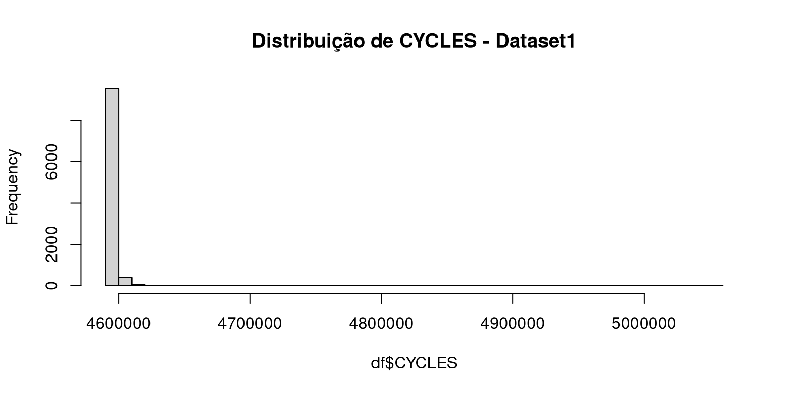

# Motivações

Os dados de medição de **ciclos de execução** foram disponibilizados para análise, visando avaliar o desempenho de diferentes programas em cenários simulados. Nosso objetivo é aplicar a **Teoria dos Valores Extremos (EVT)**, uma técnica baseada em medição, para analisar e estimar os **Limites Probabilísticos de Tempo de Execução no Pior Caso (pWCET)**.

O processo analítico envolverá a observação dos máximos dos ciclos de execução, seguido pela aplicação da modelagem pela **Distribuição Generalizada de Pareto (GP)** e a **Distribuição Generalizada de Valores Extremos (GEV)**, que unifica os modelos Weibull, Gumbel e Fréchet, evitando estimativas inseguras ou superestimadas.

Dado que os dados foram gerados em cenários simulados com a **mesma fonte de aleatoriedade/instabilidade**, o foco será na **comparação das estimativas de pWCET** obtidas a partir de diferentes *datasets*.

Esta brevce observação comparativa verificará a **consistência** dos modelos estimados (via testes de qualidade de ajuste e análise do parâmetro de forma $\xi$) e avaliar se as estimativas de pWCET, $C(p)$, convergem ou divergem, permitindo concluir se as configurações de *hardware* ou distribuições de dados subjacentes resultam em **projeções semelhantes ou distintas** para o tempo de execução no pior caso probabilístico. 👍

# Caracteristicas dos dados disponibilizados

Foram disponibilizados 4 arquivos no formato .csv, os dados de mediçao contem 7 colunas e 10.000 linhas de observações;sendo a nossa coluna de interesse a "CYCLES" devido ao seu comportamento de contagem de ciclos do Hardware durante a execução de programas. 

Neste estudo foram abstraídos os cenarios de casos de teste bechmark para execução dos programas, bem como caracteristicas do hardware que foi utilizado para captura das informações
nº de colunas	nº de linhas
7	10.000
nº total de observações	
40.000	

fibcall_perf_rec_6_eventos_15_core_sem_inter_100_x.csv
4 amostras com atquivos tipo .csv


::: {.cell tbl-cap='Dados de Performance - fibcall_rec_6_eventos_15_core'}
::: {.cell-output-display}


| nº.de.colunas | nº.de.linhas | nº.total.de.observações |
|:-------------:|:------------:|:-----------------------:|
|       7       |    10000     |          40000          |


:::
:::


::: {.cell tbl-cap='Especificações do Dataset'}

```{.r .cell-code}
dados_detalhados <- data.frame(
  Parâmetro = c("Número de arquivos", "Tipo de arquivo", "Nome Generico dos arquivos"),
  Valor = c( "4", ".csv","fibcall_perf_rec_6_eventos_15_core_sem_inter_100_x.csv")
)

knitr::kable(dados_detalhados, align = c('l', 'c'))
```

::: {.cell-output-display}


|Parâmetro                  |                         Valor                          |
|:--------------------------|:------------------------------------------------------:|
|Número de arquivos         |                           4                            |
|Tipo de arquivo            |                          .csv                          |
|Nome Generico dos arquivos | fibcall_perf_rec_6_eventos_15_core_sem_inter_100_x.csv |


:::
:::

## Ajuste de Maximos

### Block Maxima 
$$ M_{j}=max\{{{X_{({{j-1}})m+1},...,X_{jm}}}\} $$

### PoT
$$ Yi=Xi-u  ,para$$  $$ Xi>u $$

## Aplicação de EVT para WCET 

### Modelo GEV (Generalized Extreme Value)
$$ G({{z}})=exp\{-{{[1+\xi(\frac{z-\mu}{\sigma})]^{-1/\xi}}}\} $$

### Modelo GP (Generalized Pareto)
$$ H\left(y{{}}\right)=1-^{}(1+~\frac{\xi y}{\sigma}){{^{-1/\xi}}} $$

# Análise de Valores Extremos - Resultados obtidos através do metodo Bayesiano

## dataset1

::: {.cell tbl-cap='Temperature and ozone level.'}

```{.r .cell-code}
library(extRemes)
# Carregar dados
df <- read.csv2("fibcall_perf_rec_6_eventos_15_core_sem_inter_100_1.csv")

# Verificar as colunas disponíveis
names(df)
```

::: {.cell-output .cell-output-stdout}

```
[1] "CYCLES" "X0xE1"  "X0xE2"  "X0xE7"  "X0xE0"  "X0x17"  "Ox12"  
```


:::

```{.r .cell-code}
class(df$CYCLES)
```

::: {.cell-output .cell-output-stdout}

```
[1] "integer"
```


:::
:::


::: {.cell}

```{.r .cell-code}
hist(df$CYCLES, breaks = 50,main="Distribuição de CYCLES - Dataset1")
```

::: {.cell-output-display}
{width=768}
:::
:::


::: {.cell}

:::


### Ajuste de Maximos

#### Block Maxima 

#### PoT

### Aplicação de EVT para WCET 

#### Modelo GEV (Generalized Extreme Value)

#### Modelo GP (Generalized Pareto)
## dataset2
### Ajuste de Maximos

#### Block Maxima 

#### PoT

### Aplicação de EVT para WCET 

#### Modelo GEV (Generalized Extreme Value)

#### Modelo GP (Generalized Pareto)

**Quantiles of MCMC Sample from Posterior Distribution**
## dataset3
### Ajuste de Maximos

#### Block Maxima 

#### PoT

### Aplicação de EVT para WCET 

#### Modelo GEV (Generalized Extreme Value)

#### Modelo GP (Generalized Pareto)
## dataset4
### Ajuste de Maximos

#### Block Maxima 

#### PoT

### Aplicação de EVT para WCET 

#### Modelo GEV (Generalized Extreme Value)

#### Modelo GP (Generalized Pareto)

# Conclusões 
